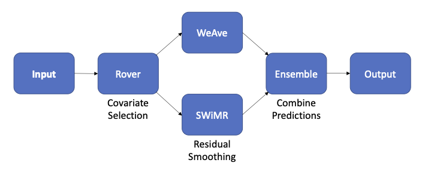

# OneMod



In many applications in epidemiology, we need to estimate a single quantity (e.g., incidence or prevalence) by leveraging covariates and correlations across multiple dimensions (e.g., age, location, or year).
This pipeline package estimates quantities using the following approach:

1. Statistical modeling with covariates
    * Create generalized linear models with [RegMod](https://github.com/ihmeuw-msca/regmod)
    * Explore covariate combinations with [ModRover](https://github.com/ihmeuw-msca/modrover)
2. Smoothing across dimensions
    * Smooth predictions using weighted averages with [WeAve](https://github.com/ihmeuw-msca/weighted-average)
    * Smooth predictions using mixed-effects models (i.e., [MR-BRT](https://github.com/ihmeuw-msca/mrtool)) 
      with [SWiMR](https://hub.ihme.washington.edu/display/MSCA/Similarity-Weighted+Meta-Regression+%28SWiMR%29+models)
3. Ensemble smoothed predictions

## Installation

To create a [conda](https://docs.conda.io/projects/conda/en/latest/index.html) environment with the OneMod package:
```
conda create -n {environment name} python=3.10
conda activate {environment name}
pip install git+https://stash.ihme.washington.edu/scm/msca/onemod.git@main
```

## Running the pipeline

To create a new OneMod pipeline:
```
onemod run_pipeline --directory {path/to/experiment/directory}
```

To resume an existing OneMod pipeline:
```
onemod resume_pipeline --workflow_id {workflow ID}
```

Both entrypoints have standard help pages you can access by suffixing the command with `-h`.
For requirements, optional arguments, and additional entrypoints, see our [example](docs/example/).
For a detailed diagram of OneMod's Jobmon workflow, see our [documentation](docs/).

## License

This project uses the following license: [BSD 2-Clause](./LICENSE)
