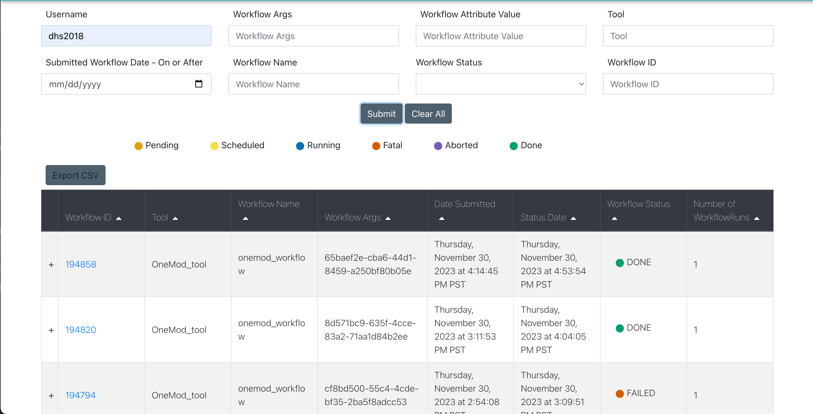
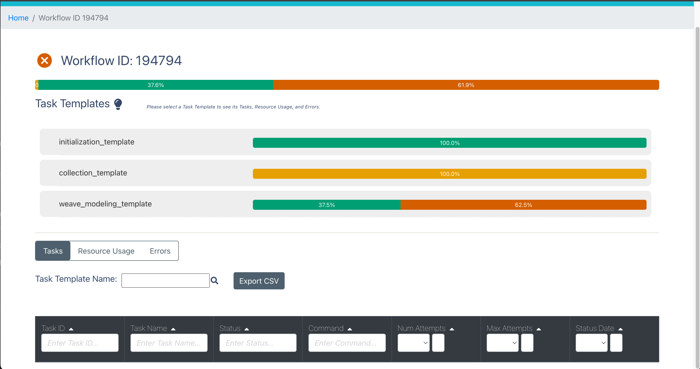

Running the pipeline
####################

OneMod is orchestrated with a tool called Jobmon. For a quick intro on Jobmon, refer to the :ref:`jobmon` section.
The full Jobmon documentation lives `here <https://jobmon.readthedocs.io/en/latest/>`_

+++++++++++++++++++++++++++++++
Directory Setup
+++++++++++++++++++++++++++++++

To create a new OneMod pipeline, the first step is setting up your experiment directory. This directory can be in any arbitrary
location, but it must contain a config folder with two files: settings.yml and resources.yml.

The former file, settings.yml, dictates the OneMod parameters you will run your model with. You can specify things like
the parallelism of your model (i.e. by sex/location or by age), the smoothing parameter, the dimensions to smooth over,
covariate constraints, and more.

**TODO: Document sample settings file usage**

The second file, resources.yml, defines the compute resources you will use to run your model. This includes the number of
cores, memory, cluster project, and runtime of your model, and can be broken down by individual task templates. You can
refer to the `Jobmon documentation <https://jobmon.readthedocs.io/en/latest/core_concepts.html#yaml-configuration-files>`_
for more information on how to structure this resources.yml file.

+++++++++++++++++++++++++++++++
Running the pipeline
+++++++++++++++++++++++++++++++

After setting up your experiment directory, running the pipeline is as easy as::

    onemod run_pipeline --directory {path/to/experiment/directory}

The workflow will distribute and monitor jobs until either the workflow is complete, or a job fails.

.. _jobmon-debugging:

+++++++++++++++++++++++++++++++++++
Debugging and resuming the pipeline
+++++++++++++++++++++++++++++++++++

Unfortunately we are not perfect developers, and you are not the perfect user, so sometimes errors occur.

To debug this workflow, you can use the `Jobmon GUI <https://jobmon-gui.scicomp.ihme.washington.edu/>`_.
You can find your workflow by querying for your username, which will bring up the landing page:

You can expand a workflow that has a failed status by clicking the workflow ID, bringing up the main workflow page.

Finally, you can see a traceback by clicking the task template with errors - in this case weave_modeling_template - and
clicking the "Errors" tab. To show a full traceback you can click on an entry in the Error Log field.

.. image:: jobmon_gui_errors.png

Once your errors are fixed, you can resume an existing OneMod pipeline with::

    onemod resume_pipeline --workflow_id {workflow ID}

Both entrypoints (run_pipeline and resume_pipeline) have standard help pages you can access by suffixing the command with -h.
